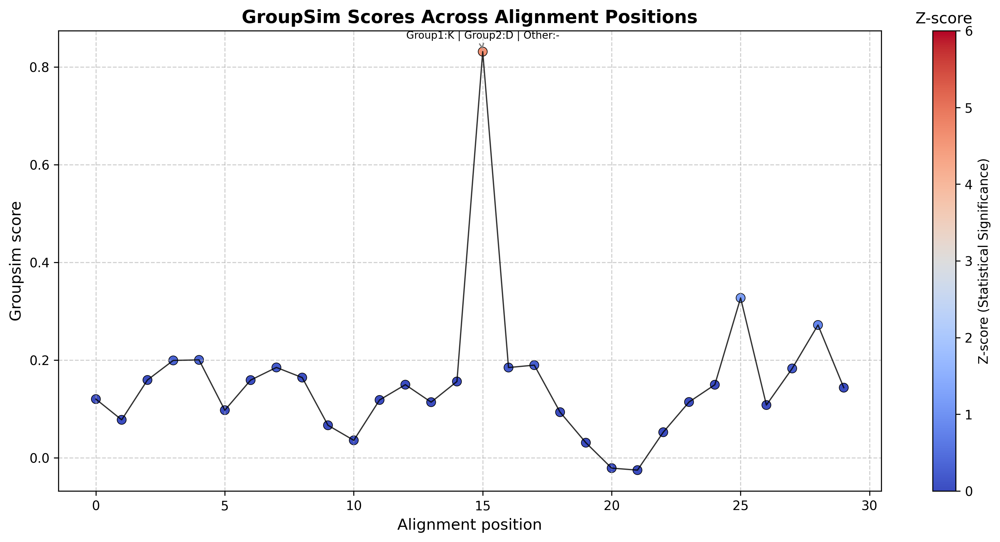
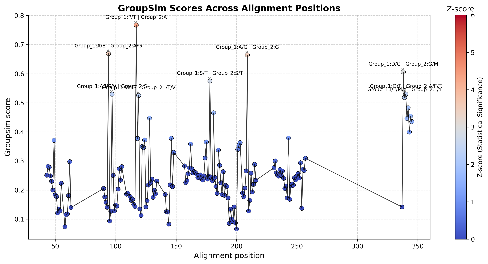
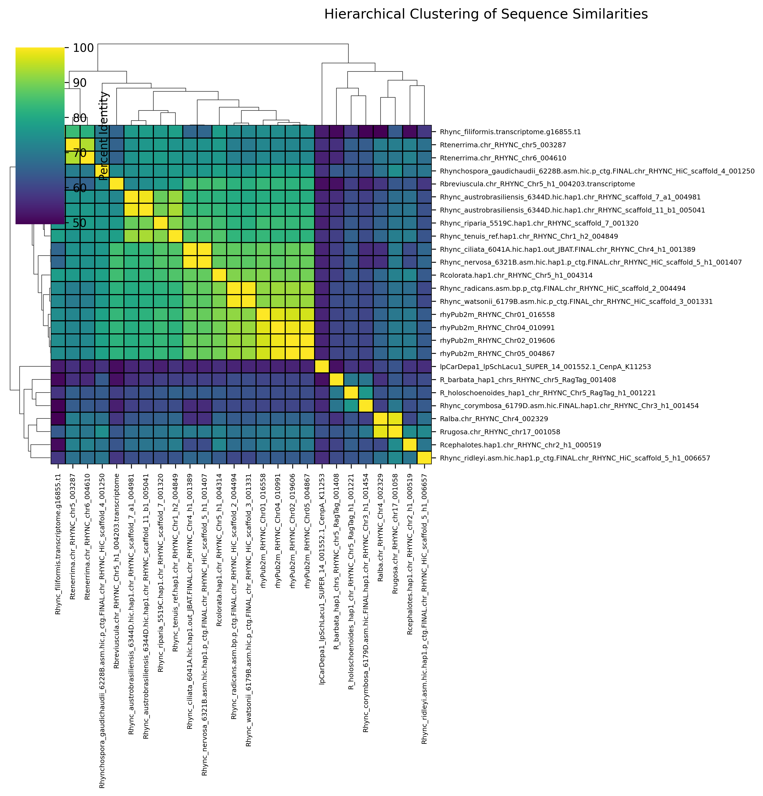
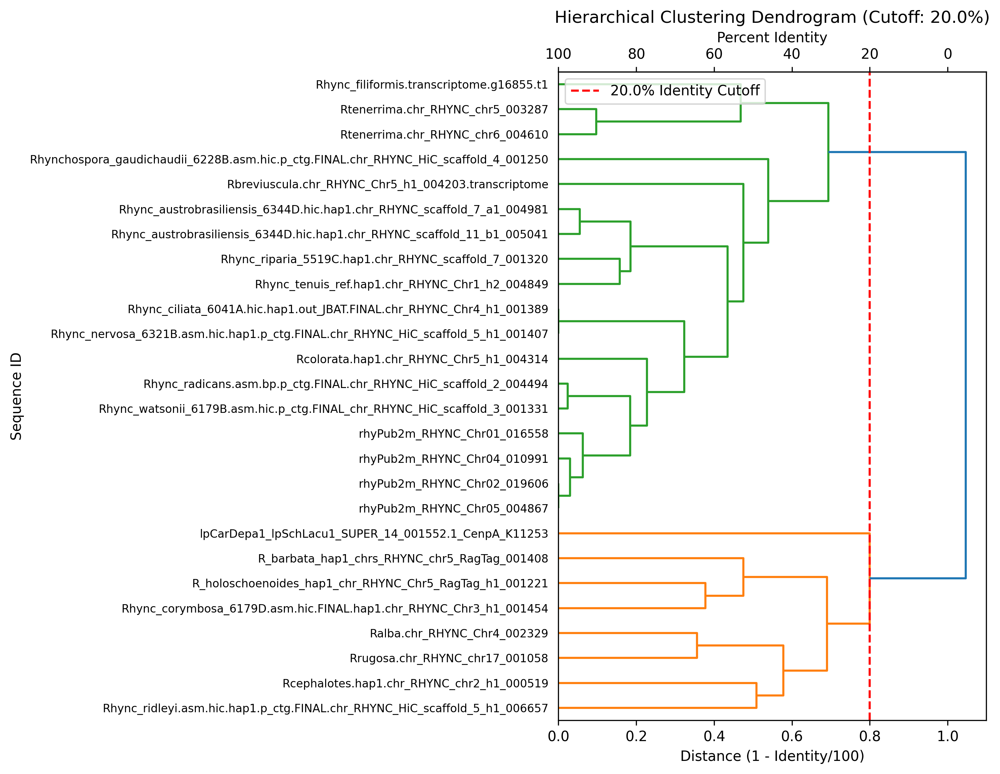

# GroupSim-Py3: Specificity-Determining Position (SDP) Detection in Protein Alignments

[](https://www.python.org/)
[](LICENSE)

A Python 3 implementation of the GroupSim algorithm for identifying specificity-determining positions (SDPs) in multiple sequence alignments. GroupSim detects positions in protein alignments that are conserved within functional groups but differ between them, making it ideal for studying functional divergence and protein specificity.

> **See [Example Outputs](#example-outputs)** below for visualization examples from the included synthetic test data.

## Features

### Automatic Group Inference
- **Identity Cutoff Mode (`-t`)**: Automatically cluster sequences based on percentage identity threshold
- **Target K Groups Mode (`-k N`)**: Specify desired number of groups, algorithm finds optimal cutoff
- **Manual Group Definition (`-k file`)**: Provide custom group assignments via file

### SDP Scoring
- **GroupSim Score Calculation**: Quantifies within-group conservation vs. between-group divergence
- **Conservation Window Heuristic**: Context-aware scoring using neighboring positions
- **Customizable Parameters**: Adjust gap thresholds, window size, and lambda weighting

### Comprehensive Visualization
- **GroupSim Score Plot**: Position-by-position view of SDP scores with Z-score coloring
- **Clustered Heatmap**: Hierarchical clustering visualization of sequence similarities
- **Dendrogram**: Tree-based representation with group cutoff lines
- **Residue Annotations**: Automatic labeling of high-scoring positions with amino acid changes

### Parameter Optimization
- **Grid Search Tool**: Find optimal window size and lambda parameters for your data
- **Z-score Analysis**: Evaluate parameter combinations based on known SDPs

## Background

GroupSim was originally developed by Capra et al. (2008) for identifying amino acid positions that confer functional specificity to protein subfamilies. This Python 3 implementation extends the original Perl/C code with:

- Modern Python 3 syntax and libraries
- Automatic sequence clustering via hierarchical methods
- Enhanced visualizations with seaborn and matplotlib
- Parameter optimization framework
- Improved user interface and documentation

**Original Paper**: Capra JA, Singh M. (2008). Characterization and prediction of residues determining protein functional specificity. *Bioinformatics*, 24(13):1473-1480. [DOI: 10.1093/bioinformatics/btn214](https://doi.org/10.1093/bioinformatics/btn214)

## Installation

### Requirements

```bash
# Create conda environment
conda create -n groupsim python=3.8
conda activate groupsim

# Install dependencies
pip install biopython numpy pandas scipy matplotlib seaborn
```

### Dependencies

- Python ≥ 3.8
- BioPython
- NumPy
- Pandas
- SciPy
- Matplotlib
- Seaborn

## Quick Start

### 1. Basic Usage with Automatic Clustering (Identity Cutoff)

```bash
cd /path/to/your/alignment/
python /path/to/groupsim-py3/src/groupsim.py -t 75.0 your_alignment.fasta
```

**Input**: FASTA alignment file

**Output**:
- `your_alignment_manhattan_plot.png`: GroupSim score plot visualization
- `your_alignment_heatmap.png`: Clustered similarity matrix
- `your_alignment_dendrogram.png`: Hierarchical clustering tree
- `your_alignment.txt`: Detailed scores and alignment with group annotations

### 2. Automatic Clustering by Target Number of Groups

```bash
python /path/to/groupsim-py3/src/groupsim.py -k 3 your_alignment.fasta
```

Automatically finds the identity cutoff that creates exactly 3 groups.

### 3. Manual Group Definition

Create a group file (`groups.txt`):
```
# Format: GroupName: Seq1, Seq2, Seq3
Kinase_A: Seq1, Seq2, Seq5
Kinase_B: Seq3, Seq4, Seq6
# Unlisted sequences automatically go to 'Other' group
```

Run GroupSim:
```bash
python /path/to/groupsim-py3/src/groupsim.py -k groups.txt your_alignment.fasta
```

### 4. Generate Test Data

```bash
cd /path/to/groupsim-py3/src/
python generate_synthetic_alignment.py
```

Creates:
- `synthetic_test.fasta`: Test alignment with known SDPs
- `synthetic_test_groups.txt`: Corresponding group definitions

### 5. Optimize Parameters

```bash
cd /path/to/groupsim-py3/src/
python optimize_groupsim_parameters.py
```

Performs grid search over window size (`-w`) and lambda (`-l`) parameters to maximize Z-scores of known SDPs.

## Example Outputs

### Synthetic Test Data (Controlled Example)

#### GroupSim Score Plot - Synthetic Alignment



*GroupSim score plot from synthetic test alignment with engineered SDPs. Position 15 shows a perfect SDP (Group1: K, Group2: D) with Z-score > 8. Position 25 shows a moderate SDP with mixed residues within groups. Colors represent Z-scores, with red indicating high specificity.*

**Key Features**:
- **Position 15**: Perfect SDP - all Group1 sequences have K, all Group2 have D
- **Position 5**: Conserved position (all A) - score near zero
- **Position 25**: Moderate SDP - some within-group variation
- Demonstrates how GroupSim distinguishes true SDPs from noise

### Real Biological Data (CENH3 Analysis)

#### GroupSim Score Plot - Centromeric Histone H3 (CENH3)



*Real-world analysis of CENH3 (centromeric histone H3) sequences from Rhynchospora species. Multiple high-scoring positions (Z > 2.0) are annotated with group-specific residues, revealing positions that may determine functional specificity between CENH3 variants. Black line shows the mean trend across the alignment.*

**Biological Interpretation**:
- **High peaks (red)**: Candidate specificity-determining positions in CENH3
- **Clustered peaks**: Functional domains or binding interfaces
- **Annotations**: Show actual amino acid changes between CENH3 groups (e.g., "Group_1:V/I | Other:A/T")
- Demonstrates GroupSim on real protein family data with biological relevance

#### Clustered Heatmap with Dendrogram



*Hierarchical clustering heatmap from CENH3 analysis showing pairwise sequence similarities. Dendrograms on the top and left show the clustering tree structure. The color scale represents percent identity (yellow = high similarity, purple = low similarity). Sequences naturally cluster into CENH3 variant groups.*

**Interpretation**:
- **Yellow blocks**: Groups of highly similar CENH3 sequences (same variant/species)
- **Purple regions**: Divergent sequences or between-group comparisons
- **Dendrogram structure**: Branch lengths indicate evolutionary/sequence distance
- **Natural clusters**: Visual identification of CENH3 functional groups

#### Dendrogram with Group Cutoff



*Hierarchical clustering dendrogram from CENH3 analysis showing sequence relationships. The red dashed line indicates the identity cutoff used for group assignment. The top axis shows percent identity, bottom axis shows distance (1 - identity/100). Sequences clustering below the cutoff line belong to the same functional group.*

**Interpretation**:
- **Clusters below cutoff**: CENH3 sequences in the same variant group
- **Branch colors**: Different colors after cutoff indicate different CENH3 variants
- **Branch lengths**: Longer branches = greater sequence divergence between variants
- **Dual axes**: View as either distance or percent identity
- **Cutoff selection**: Red line shows the threshold determining group boundaries

## Methodology

### GroupSim Score Formula

For each alignment position *i*, GroupSim calculates:

```
Score(i) = Conservation_weight × (Mean_within - Mean_between)
```

Where:
- **Mean_within**: Average pairwise similarity within each group
- **Mean_between**: Average pairwise similarity between groups
- **Conservation_weight**: `(1 - gap_fraction)` to downweight gappy positions

**High positive scores** indicate positions that are:
1. Conserved within each functional group
2. Different between functional groups
3. Not dominated by gaps

### Conservation Window Heuristic

To account for local conservation context:

```
Final_score(i) = λ × Raw_score(i) + (1-λ) × Window_conservation(i)
```

Where:
- **Window_conservation**: Jensen-Shannon divergence averaged over neighboring positions
- **λ** (lambda): Weight parameter (default=0.7) balancing raw score vs. context

### Z-score Normalization

For identifying significant SDPs:

```
Z(i) = (Score(i) - μ) / σ
```

Positions with **Z > 2.0** are typically considered significant specificity-determining positions.

### Hierarchical Clustering (Automatic Mode)

When using `-t` or `-k N`:

1. Calculate pairwise percent identity for all sequences
2. Convert to distance matrix: `Distance = 1 - (Identity/100)`
3. Perform hierarchical clustering (UPGMA/average linkage)
4. Cut dendrogram at specified identity threshold (`-t`) or to achieve K groups (`-k N`)

## Command-Line Options

### Group Inference (Choose One)

| Option | Description | Example |
|--------|-------------|---------|
| `-t FLOAT` | Identity cutoff (0-100%) | `-t 75.0` |
| `-k INT` | Target number of groups | `-k 3` |
| `-k FILE` | Manual group definition file | `-k groups.txt` |

### GroupSim Scoring Parameters

| Option | Description | Default |
|--------|-------------|---------|
| `-c FLOAT` | Column gap cutoff (0-1) | 0.1 |
| `-g FLOAT` | Group gap cutoff (0-1) | 0.3 |
| `-w INT` | Conservation window size | 3 |
| `-l FLOAT` | Lambda for window weighting (0-1) | 0.7 |
| `-m FILE` | Custom similarity matrix | identity |
| `-n` | Normalize scores to [0,1] | off |

### Output Options

| Option | Description |
|--------|-------------|
| `-o PREFIX` | Output filename prefix |
| `-h` | Show help message |

## File Formats

### Input: FASTA Alignment

```
>Sequence1_KinaseA
MARKGVLYYGSKTRL---
>Sequence2_KinaseA
MARKGVLYYGSKTRL---
>Sequence3_KinaseB
MARKGVLDYGNKTRL---
```

### Input: Manual Group File

```
# Lines starting with '#' are comments
# Format: GroupID: Seq1, Seq2, Seq3
Group_A: Sequence1, Sequence2
Group_B: Sequence3, Sequence4
# Unlisted sequences → 'Other' group
```

### Output: Score File

```
# synthetic_test.fasta scored by GroupSim with identity matrix (Grouping by: Manual)
# Grouping criterion: 100.0% identity cutoff
# window params: len=3, lambda=0.70
# group gap cutoff: 0.30  column gap cutoff: 0.10
# Groups: Group1, Group2
# col_num	score	column_residues
0	0.121456	AAAAA | AAAAA
5	0.000000	AAAAA | AAAAA
15	0.900000	KKKKK | DDDDD
...

## Detailed Specificity Score and Alignment
# Grouping Cutoff: 100.0% identity cutoff
Score     0.121  0.000  ...  0.900  ...
Index     0      5      ...  15     ...
--------------------------------------------
Seq1|G1   A      A      ...  K      ...
Seq2|G1   A      A      ...  K      ...
Seq3|G2   A      A      ...  D      ...
```

## Advanced Usage

### Custom Similarity Matrix

Provide a BLOSUM or PAM matrix file:

```bash
python groupsim.py -t 70.0 -m BLOSUM62.txt alignment.fasta
```

Matrix format: 20x20 space-separated values for standard amino acids.

### Adjusting Gap Thresholds

```bash
# Stricter gap filtering
python groupsim.py -t 75.0 -c 0.05 -g 0.2 alignment.fasta
```

- `-c`: Skip columns with >5% gaps
- `-g`: Skip scoring if any group has >20% gaps

### Optimizing Window Parameters

For your specific alignment:

1. Edit `src/optimize_groupsim_parameters.py`:
   ```python
   ALIGNMENT_FILE = "your_alignment.fasta"
   GROUP_FILE = "your_groups.txt"
   TARGET_SDP_POSITIONS = [10, 25, 42]  # Known SDPs
   ```

2. Run optimization:
   ```bash
   python optimize_groupsim_parameters.py
   ```

3. Select (W, L) pair with highest `Avg_Z_SDPs`

## Example Workflow

```bash
# 1. Navigate to your data directory
cd /path/to/protein_families/

# 2. Generate alignment (if not already done)
# mafft --auto sequences.fasta > alignment.fasta

# 3. Run GroupSim with identity cutoff
python ~/groupsim-py3/src/groupsim.py -t 80.0 alignment.fasta

# 4. Review outputs
# - alignment_manhattan_plot.png: Visual overview
# - alignment.txt: Detailed scores

# 5. Extract high-scoring SDPs
awk '$2 != "None" && $2 > 0.5' alignment.txt | head -20

# 6. (Optional) Optimize parameters for your data
cp alignment.fasta ~/groupsim-py3/src/
cd ~/groupsim-py3/src/
# Edit optimize_groupsim_parameters.py with your file and known SDPs
python optimize_groupsim_parameters.py
```

## Interpreting Results

### What Makes a Good SDP?

High GroupSim scores indicate positions where:
1. **Within-group conservation is high**: Each group has low variability
2. **Between-group divergence is high**: Groups differ from each other
3. **Not dominated by gaps**: Position is structurally relevant

### Typical Score Distributions

| Z-score | Interpretation | Action |
|---------|----------------|--------|
| Z > 3.0 | Very strong SDP | High-priority experimental validation |
| Z > 2.0 | Significant SDP | Good candidate for functional studies |
| Z > 1.0 | Moderate signal | May be relevant in context |
| Z < 1.0 | Weak/no signal | Likely not functionally specific |

### Common Patterns

- **Sharp peaks**: Single critical residues (e.g., active site specificity)
- **Plateau regions**: Functional domains with multiple SDPs (e.g., binding interfaces)
- **Scattered high scores**: Multiple independent specificity determinants

## Troubleshooting

### Issue: "Problem reading or parsing alignment file"

**Solution**: Ensure alignment is in FASTA or CLUSTAL format. Check for:
- Proper headers (starting with `>` for FASTA)
- Equal sequence lengths (alignment, not raw sequences)
- Valid amino acid characters

### Issue: "Grouping resulted in only 1 group"

**Solution**: Identity cutoff may be too strict. Try:
- Lower `-t` value (e.g., `-t 50.0` instead of `-t 90.0`)
- Use `-k N` to specify desired groups
- Check if sequences are actually similar enough to cluster

### Issue: "No valid scores to plot"

**Solution**: Gap thresholds may be too strict. Try:
- Increase `-c` and `-g` values (e.g., `-c 0.3 -g 0.5`)
- Check alignment quality (excessive gaps?)

### Issue: Low Z-scores for known SDPs

**Solution**: Optimize parameters:
- Adjust `-w` (window size): Try 1, 3, 5, 7
- Adjust `-l` (lambda): Try 0.5, 0.7, 0.9
- Use `optimize_groupsim_parameters.py` for systematic search

## Examples

Example data is provided in `data/examples/`:
- `synthetic_test.fasta`: Test alignment with engineered SDPs
  - Position 5: Conserved (Score ≈ 0)
  - Position 15: Perfect SDP (Score > 0.9)
  - Position 25: Moderate SDP (Score ≈ 0.5)
- `synthetic_test_groups.txt`: Group definitions
- `cenh3_group1.txt`: Real example from centromeric histone analysis

Run on examples:

```bash
cd /path/to/groupsim-py3/data/examples/
python ../../src/groupsim.py -k synthetic_test_groups.txt synthetic_test.fasta
```

## Citation

If you use GroupSim-Py3 in your research, please cite both this implementation and the original paper:

### This Implementation

```
González, J. (2025). GroupSim-Py3: Python 3 Implementation of the GroupSim Algorithm for SDP Detection.
GitHub: https://github.com/jacgonisa/groupsim-py3
```

### Original Algorithm

```
Capra JA, Singh M. (2008). Characterization and prediction of residues determining
protein functional specificity. Bioinformatics, 24(13):1473-1480.
DOI: 10.1093/bioinformatics/btn214
```

## Contributing

Contributions are welcome! Please:
1. Fork the repository
2. Create a feature branch
3. Submit a pull request

## License

MIT License - see [LICENSE](LICENSE) file for details

## Contact

- **Author**: Javier González
- **GitHub**: [@jacgonisa](https://github.com/jacgonisa)
- **Repository**: https://github.com/jacgonisa/groupsim-py3

## Related Resources

- **Original GroupSim**: https://compbio.cs.princeton.edu/specificity/
- **Original Paper**: https://doi.org/10.1093/bioinformatics/btn214
- **Entropia-MSA** (companion tool for entropy analysis): https://github.com/jacgonisa/entropia-msa

## Acknowledgments

- Original GroupSim algorithm: John Capra and Mona Singh (Princeton University)
- Python 3 implementation and extensions: Javier González
- Developed for comparative genomics and phylogenomics studies

## Version History

- **v1.0.0** (2025-11-20): Initial release
  - Python 3 implementation of GroupSim algorithm
  - Automatic clustering by identity cutoff or target K groups
  - Manual group definition support
  - Enhanced visualizations (SDP score plot, heatmap, dendrogram)
  - Parameter optimization framework
  - Comprehensive documentation and examples
